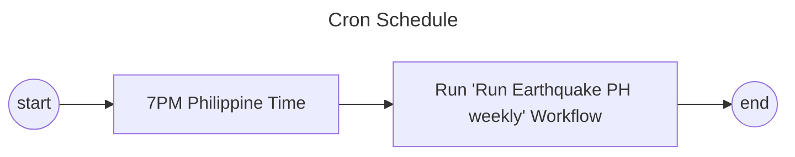

# Philippine Earthquakes
## Gathering Philippine Earthquakes
|  | Content |
|:------|:--------|
| Description| A Python notebook that web scrapes a Philippine website to extract data about earthquakes. <br> <br> I want to gather earthquake data from the Philippines, however the data displayed on PHIVOLCS are limited only by the recent month. So I want a consolidated data, not just from the displayed latest data. <br> <br> The data can be used for the following: <br> 1. Analysis of the Philippines' most hitted regions <br> 2. Correlation with casualties alongside with other disasters |
| Field | Data Science (*Data Engineering*), Automation (*Scripting*) |
| Focus | Webscraping |
| Other focuses | regex, data preprocessing, Extract-Transform-Load (ETL) |
| Tools used | Python, Python notebook, cron |
| Important links | [DOST Earthquake Data](https://earthquake.phivolcs.dost.gov.ph/EQLatest-Monthly/)
| External libraries used | pandas, BeautifulSoup, requests |
| Latest Manual Update | June 23, 2025 |

## File Structure
```
PH Earthquakes
├── data/
|   ├── processed/
|   |
|   ├── raw/
|   |
|   L── test/
|
├── documents/
|
├── scripts/
|   ├── extract/
|   ├── load/
|   ├── testing/
|   ├── transform/
|   ├── code_profiling.py
|   ├── etl.py
|   ├── send_report.py
|   L── style_checker.py
|
L── README.md
```
## Automation Workflow

